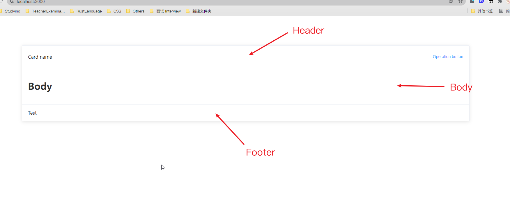

# Fake Card

复制 element-plus/el-card 组件

## 属性

| 属性   | 说明                                                         | 类型   | 可选值                 | 默认值 |
| :----- | :----------------------------------------------------------- | :----- | :--------------------- | :----- |
| header | 卡片的标题 你既可以通过设置 header 来修改标题，也可以通过 `slot#header` 传入 DOM 节点 | string | —                      | —      |
| footer | 卡片的标题 你既可以通过设置 footer来修改底部，也可以通过 `slot#footer` 传入 DOM 节点 | string | —                      | —      |
| shadow | 设置阴影显示时机                                             | string | always / hover / never | always |



## 使用

```vue
<template>
  <FakeCard class="custom" >
    <template #header>
      <div class="card-header">
        <span>Card name</span>
        <el-button class="button" type="text">Operation button</el-button>
      </div>
    </template>
    <h1>Body</h1>
    <template #footer>
      <span>Test</span>
    </template>
  </FakeCard>
</template>
<script lang="ts" setup>
import FakeCard from 'FakeCard.vue';
</script>

<style>
.custom {
  margin: 100px auto;
  width: 80vw;
}
.card-header {
  display: flex;
  justify-content: space-between;
  align-items: center;
}
</style>
```